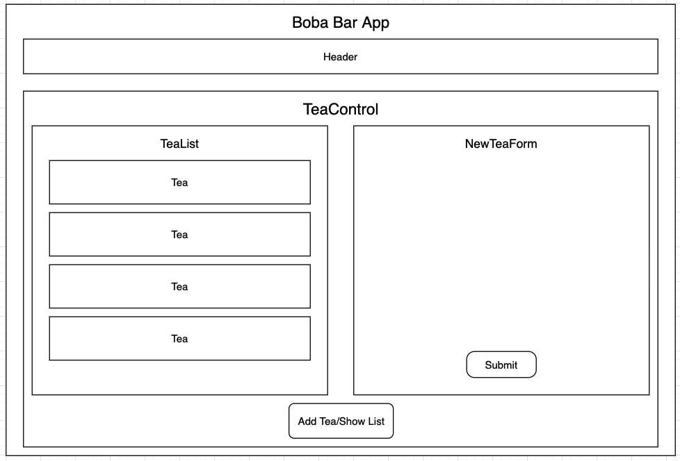
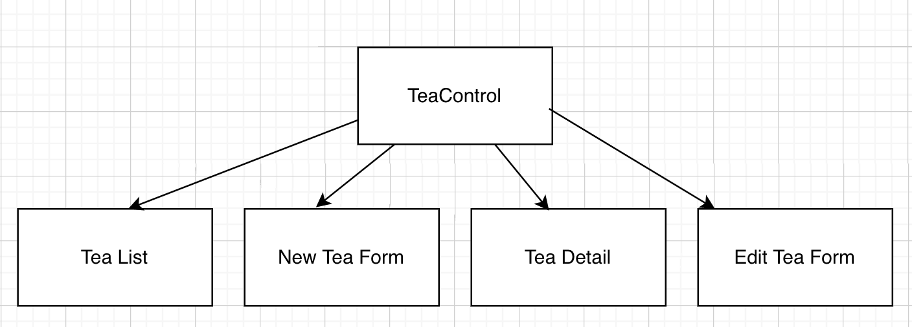

# _Tap Room_

#### _Tap Room - 09/10/21 - Code Review016_

#### By _**Jennifer Bordon**_

## Technologies Used

* _Git_
* _HTML_
* _CSS_ 
* _Bootstrap_
* _JavaScript_
* _npm_
* _webpack_
* _eslint_
* _React_

## Description
This is a Tap Room where a Boba Bar can track its tea storage!

It will at the minimum, have CREATE and READ functionality. And if am succesfully ambitious, will have UPDATE and DELETE functionality.

User stories:
- as a user, I want to see a list/menu of all available teas. For each tea, I want to see its
  - `name`
  - `brand`
  - `price`
  - `flavor`
- as a user, I want to submit a form to add a new tea to a list
- as a user, I want to be able to click on a tea to see its detail page
- as a user, I want to see how many pints are left in a tea urn (holds 32 pints)
- as a user, I want to be able to click a button next to a keg whenever I sell a pint of it.
  - this should decrease the number of pints left by 1
  - pints should not go below 0

## Plan/Component Diagram
Initial MVP that has CREATE and READ functionality

Final product with CRUD

## Setup/Installation Requirements
* Clone this project into your preferred directory
* In that directory, there should now be a directory labeled "epicodus-tapRoom"
* run `npm i` to install respective plugins/packages
* run `npm start` to go see a live server of the app

## Known Bugs

* _Currently no known bugs._

## License

Distributed under the MIT License. See LICENSE for more information.

## Contact Information

_jennifer.bordon@gmail.com_

